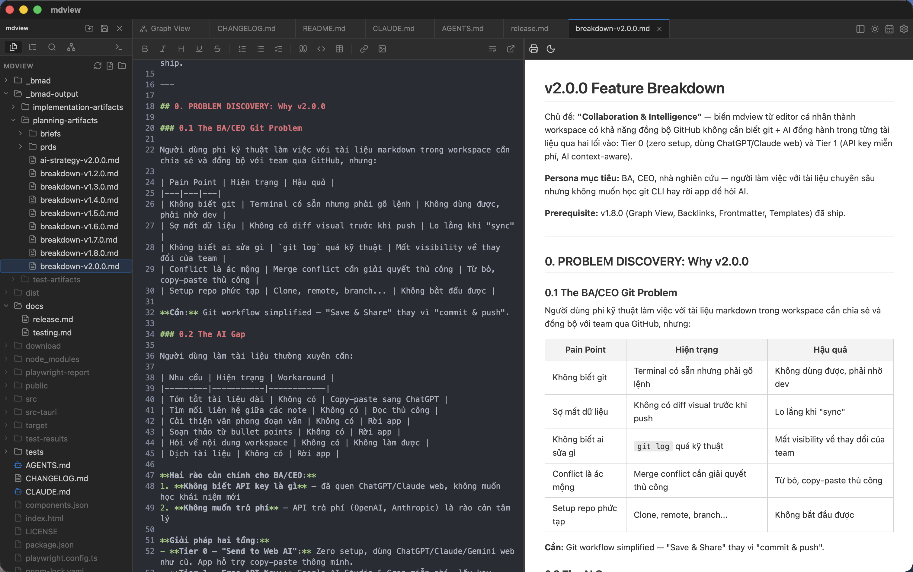
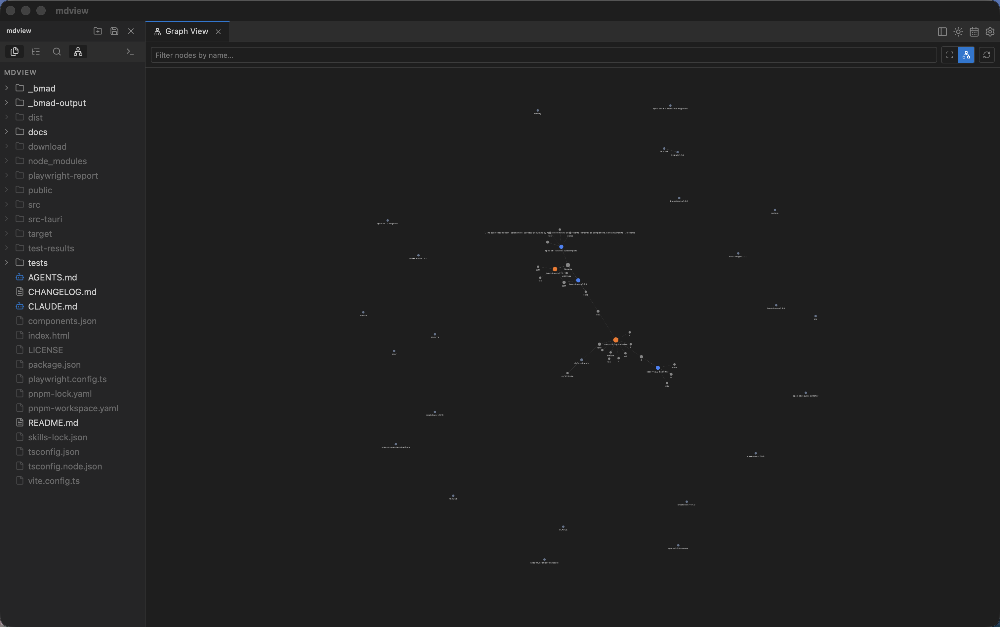

# mdview

**Focused Markdown workspace editor for developers, writers, and AI practitioners.**

*Editor Markdown tập trung cho dev, writer và ai đang làm việc với AI agent.*

**🌐 Website: [mdviewz.vercel.app](https://mdviewz.vercel.app)** · [Download](https://github.com/aniadev/mdview/releases)

---

mdview is a desktop app for people who keep notes, documentation, or AI agent instructions in Markdown files inside a project folder. A smart file tree, a split-pane editor with live preview, an integrated terminal, and a growing set of productivity tools — without the bloat.

*mdview là desktop app cho những ai giữ note, docs hoặc AI agent instructions trong Markdown — bên trong một project folder. File tree thông minh, split-pane editor với live preview, terminal tích hợp sẵn, và đủ thứ tool năng suất — không bloat, không rác.*





[Website](https://mdviewz.vercel.app) · [Changelog](./CHANGELOG.md) · [GitHub Releases](https://github.com/aniadev/mdview/releases)

---

## Who is it for? / Dành cho ai?

| | EN | VI |
|---|---|---|
| 🧑‍💻 | Developers keeping `docs/` or `notes/` in a repo | Dev giữ docs trong repo |
| ✍️ | Writers maintaining a Markdown knowledge base | Writer quản lý knowledge base bằng Markdown |
| 🤖 | AI practitioners editing `CLAUDE.md`, `AGENTS.md`, `.cursorrules` | Ai đang build AI agent và cần edit instructions file |
| 📓 | Daily journalers who want `Alt+D` to open today's note | Người ghi journal hàng ngày — một phím mở note hôm nay |

---

## Features / Tính năng

### 🗂️ Workspace & File Explorer

**EN**
- Open a single folder or a multi-root `.code-workspace` file — persisted across sessions
- File tree that **dims** any directory containing no `.md` descendant — focus stays on what matters
- Create files (`+`) and folders from the sidebar; typing `notes/2026/day1.md` auto-creates intermediate directories
- Rename and delete from the right-click context menu
- Multi-select files with `Cmd/Ctrl+Click`; bulk copy/cut/paste with `Cmd+C` / `Cmd+V`
- Copy and paste entire folder structures; conflict names auto-resolved with `-copy` suffix
- Refresh any workspace root while preserving expanded/collapsed state
- Add or remove folders from multi-root workspaces; save as `.code-workspace`
- AI agent file recognition — `CLAUDE.md`, `AGENTS.md`, `.cursorrules` etc. get a distinct bot icon

**VI**
- Mở folder đơn hoặc `.code-workspace` multi-root — nhớ giữa các session
- File tree tự **dim** những folder không có `.md` nào bên trong — focus vào thứ quan trọng
- Tạo file (`+`) và folder ngay trong sidebar; gõ `notes/2026/day1.md` là tự tạo luôn các folder cha
- Rename, delete qua right-click context menu
- Multi-select bằng `Cmd/Ctrl+Click`; bulk copy/cut/paste như bình thường
- Copy cả folder tree, conflict tự resolve bằng hậu tố `-copy`
- Refresh workspace root mà không mất trạng thái expand/collapse
- Thêm/xóa folder trong multi-root workspace; save thành `.code-workspace`
- `CLAUDE.md`, `AGENTS.md`, `.cursorrules` — tự nhận diện và hiện icon robot riêng

---

### ✏️ Editor

**EN**
- CodeMirror 6 with Markdown syntax highlighting
- Split-pane layout: source editor left, live GFM preview right — divider is draggable
- Bidirectional scroll sync (editor ↔ preview), heading-segment algorithm, no alignment drift
- Toolbar: Bold · Italic · Heading · Underline · Strikethrough · Lists · Checklist · Quote · Code block · Table · Link · Image · Open in browser
- `Cmd/Ctrl+F` in-editor search panel (regex, case-sensitive, match highlighting)
- Toggle word wrap for prose vs. code focus
- `Cmd/Ctrl+S` save · `Cmd/Ctrl+W` close tab · `Cmd/Ctrl+B` sidebar toggle
- Wikilink `[[]]` autocomplete — typing `[[` opens a fuzzy file picker; selecting inserts the link

**VI**
- CodeMirror 6, syntax highlight Markdown đầy đủ
- Split-pane: editor trái, GFM preview phải — kéo thanh chia thoải mái
- Scroll sync 2 chiều (editor ↔ preview), thuật toán theo heading segment, không bị lệch
- Toolbar: Bold · Italic · Heading · Underline · Strikethrough · Lists · Checklist · Quote · Code block · Table · Link · Image · Open in browser
- `Cmd/Ctrl+F` search panel ngay trong editor (regex, case-sensitive, highlight match)
- Toggle word wrap — xoay giữa chế độ prose và code
- `Cmd/Ctrl+S` save · `Cmd/Ctrl+W` đóng tab · `Cmd/Ctrl+B` toggle sidebar
- Wikilink `[[]]` autocomplete — gõ `[[` là ra danh sách file fuzzy, chọn là chèn link luôn

---

### 👁️ Preview

**EN**
- GitHub Flavored Markdown (GFM) rendered with `markdown-it`
- Math: `$inline$` and `$$block$$` via KaTeX
- Diagrams: fenced ` ```mermaid ``` ` blocks, lazily loaded
- Interactive checklists — click any `[ ]` in the preview to toggle it; change applied to the editor via CodeMirror transaction (undo/redo preserved)
- Relative image paths resolved against the file's directory and served via Tauri's asset protocol
- Clickable links: relative `.md` links open as a new tab; external URLs open in the system browser
- Export to browser: renders a self-contained HTML snapshot (inlined CSS, KaTeX, highlight.js) and opens it in the default browser

**VI**
- GFM render bằng `markdown-it`, chuẩn GitHub
- Math: `$inline$` và `$$block$$` qua KaTeX
- Diagram: khối ` ```mermaid ``` ` lazy-load, không nặng cold start
- Checklist tương tác — click thẳng vào `[ ]` trong preview để toggle; thay đổi apply vào editor qua CM transaction, undo/redo vẫn hoạt động
- Đường dẫn ảnh tương đối tự resolve theo thư mục của file
- Link có thể click: `.md` nội bộ mở thành tab mới, URL ngoài mở trình duyệt hệ thống
- Export ra browser: render HTML độc lập (CSS + KaTeX + highlight.js nhúng sẵn), mở bằng trình duyệt mặc định

---

### 🔍 Navigation & Search / Điều hướng & Tìm kiếm

**EN**
- **Command Palette** `Cmd/Ctrl+P` — fuzzy file search, shows recent files first; prefix `#` to search headings across all workspace files
- **Global Workspace Search** `Cmd/Ctrl+Shift+F` — full-text search across all `.md` files, multi-threaded Rust backend, results grouped by file with highlighted snippets; click to jump to the matching line
- **Outline panel** — interactive Table of Contents, tracks reading position, click to navigate editor and preview simultaneously
- **Recent workspaces** — last 10 folders or `.code-workspace` files shown in the empty sidebar on launch

**VI**
- **Command Palette** `Cmd/Ctrl+P` — fuzzy search file, file gần đây hiện trước; thêm `#` để tìm heading trong toàn bộ workspace
- **Global Search** `Cmd/Ctrl+Shift+F` — full-text search toàn bộ `.md`, backend Rust đa luồng, kết quả nhóm theo file với snippet highlight; click là nhảy đến dòng khớp
- **Outline panel** — Table of Contents tương tác, theo dõi vị trí đọc, click để navigate cả editor lẫn preview cùng lúc
- **Recent workspaces** — 10 folder hoặc `.code-workspace` gần nhất hiện ngay khi sidebar trống

---

### 📓 Daily Notes / Ghi chú hàng ngày

**EN**
- `Alt+D` — creates or opens today's `YYYY-MM-DD.md` with a heading template, cursor at the last line ready to type
- Configurable save directory in Settings

**VI**
- `Alt+D` — tạo hoặc mở `YYYY-MM-DD.md` hôm nay với heading template sẵn, cursor ở dòng cuối, gõ luôn
- Thư mục lưu cấu hình được trong Settings

---

### 💻 Integrated Terminal / Terminal tích hợp

**EN**
- Full PTY terminal panel toggled with `` Cmd/Ctrl+` `` or `Cmd+J`
- Multi-session terminal tabs, each with its own xterm and PTY
- "Open Terminal Here" from any file or folder in the Explorer context menu — session pre-`cd`'d to that path
- Panel persists across hide/show cycles — PTY sessions survive toggling

**VI**
- Terminal PTY đầy đủ, toggle bằng `` Cmd/Ctrl+` `` hoặc `Cmd+J`
- Multi-session — mỗi tab có xterm và PTY riêng
- "Open Terminal Here" từ bất kỳ file/folder nào trong Explorer — tự `cd` vào đúng path
- Panel ẩn/hiện mà PTY session vẫn sống, không mất shell state

---

### 🎨 Appearance & UX / Giao diện & Trải nghiệm

**EN**
- Dark (default) and light themes, persisted
- Resizable sidebar (140–480 px, drag the right edge)
- Drag-and-drop tab reordering with visual drop indicators
- Scroll chevrons in the tab bar for overflowed tabs
- In-app toast notifications for non-blocking feedback
- First-run interactive tour (9 steps)
- Native macOS app menu: Settings `Cmd+,`, standard Edit menu, Quit
- In-app updater — checks on launch (silent) and on demand; shows download progress; relaunches automatically

**VI**
- Dark (mặc định) và light theme, được nhớ giữa session
- Sidebar resize được (140–480 px) — kéo cạnh phải là xong
- Drag-and-drop tab để sắp xếp lại thứ tự, có visual indicator
- Chevron cuộn trong tab bar khi tab tràn
- Toast notification nhẹ, không block thao tác
- Tour hướng dẫn lần đầu chạy app (9 bước)
- Native macOS menu: Settings `Cmd+,`, Edit menu chuẩn, Quit
- In-app updater — tự check khi khởi động (silent) và check thủ công; hiện progress download; tự relaunch sau khi cài

---

### 🌐 Internationalization / Quốc tế hóa

**EN** — UI language toggleable between English and **Tiếng Việt** from Settings.

**VI** — Chuyển ngôn ngữ UI giữa English và **Tiếng Việt** ngay trong Settings.

---

## Keyboard Shortcuts / Phím tắt

| Action / Thao tác | Shortcut |
|---|---|
| Save / Lưu | `Cmd/Ctrl+S` |
| Close tab / Đóng tab | `Cmd/Ctrl+W` |
| Command Palette | `Cmd/Ctrl+P` |
| Workspace Search / Tìm kiếm toàn workspace | `Cmd/Ctrl+Shift+F` |
| Toggle Sidebar / Ẩn/hiện sidebar | `Cmd/Ctrl+B` |
| Toggle Terminal / Ẩn/hiện terminal | `` Cmd/Ctrl+` `` · `Cmd+J` |
| Bold / In đậm *(in editor)* | `Cmd/Ctrl+B` |
| Italic / In nghiêng *(in editor)* | `Cmd/Ctrl+I` |
| Find in editor / Tìm trong editor | `Cmd/Ctrl+F` |
| Daily Note / Ghi chú hôm nay | `Alt+D` |
| Settings / Cài đặt *(macOS)* | `Cmd+,` |

---

## macOS Install Note / Lưu ý khi cài trên macOS

**EN** — mdview is not yet signed with an Apple Developer ID. Gatekeeper will block the first launch.

**Option A — System Settings:**
1. Try to open mdview from `/Applications` — you'll see the warning.
2. Open **System Settings → Privacy & Security**.
3. Scroll down and click **Open Anyway** next to the mdview entry.

**Option B — Terminal:**
```sh
xattr -dr com.apple.quarantine /Applications/mdview.app
```

You only need to do this once. Updates installed via the in-app updater inherit the trust.

---

**VI** — mdview chưa được ký bằng Apple Developer ID nên Gatekeeper sẽ chặn lần đầu mở.

**Cách A — System Settings:**
1. Mở mdview từ `/Applications` — thấy cảnh báo là đúng rồi.
2. Vào **System Settings → Privacy & Security**.
3. Cuộn xuống, nhấn **Open Anyway** cạnh mdview.

**Cách B — Terminal:**
```sh
xattr -dr com.apple.quarantine /Applications/mdview.app
```

Làm một lần là xong. Các bản update sau qua in-app updater kế thừa luôn, không cần làm lại.

---

## Development / Phát triển

**Requirements / Yêu cầu:** Node 18+, pnpm, Rust toolchain (`rustup`), [Tauri 2 prerequisites](https://tauri.app/start/prerequisites/)

```sh
pnpm install
pnpm tauri:dev          # full app (Vite + Rust) — cần cái này để test Tauri commands
pnpm dev                # frontend only, invoke() sẽ không hoạt động
pnpm typecheck          # vue-tsc --noEmit
```

### Build Installers / Tạo bản cài đặt

```sh
pnpm tauri:build:mac-universal   # macOS universal (x86_64 + arm64) — .app + .dmg
pnpm tauri:build:win             # Windows x64 — NSIS + MSI (cần Windows host)
pnpm tauri:build:linux           # Ubuntu/Debian — AppImage + .deb (cần Linux host)
```

### Release / Phát hành

Tag và push — CI tự build macOS universal, Windows x64/arm64, Ubuntu x64 và publish lên GitHub Releases.

```sh
git tag v1.x.x
git push origin v1.x.x
```
